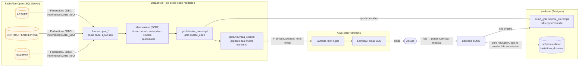

# eCMD — données (architecture médaillon Databricks)

Ce dossier est un **Databricks Asset Bundle** (`ecmd-data`). Il récupère les données du backoffice **Open**
(assurés, contrats, entreprises, sinistres), les fiabilise en couches **bronze → silver → gold**, puis les met
à disposition de l'application eCMD. Objectif : **préremplir le certificat médical** (les champs grisés du portail)
et **envoyer automatiquement l'invitation** (email) à l'assuré quand un nouveau sinistre arrive dans Open.



## Contenu

```
data/
├── databricks.yml                       # bundle : variables et cibles dev / prod
├── open/                                # côté SQL Server d'Open (à transmettre aux DBA)
│   ├── schema_open_sqlserver.sql        # schéma Open supposé = contrat de lecture eCMD (+ index DATE_MAJ)
│   └── acces_lecture_ecmd.sql           # compte de lecture seule ecmd_lecture, réseau, RCSI
├── resources/
│   ├── ecmd_open.job.yml                # job : Open → bronze → silver/gold → Lakebase → Step Functions
│   ├── ecmd_open_verification.job.yml   # job : vérification de la source Open
│   └── ecmd_medaillon.pipeline.yml      # pipeline Lakeflow déclaratif (silver + gold)
└── src/
    ├── federation/connexion_open.sql    # connexion Lakehouse Federation SQL Server + catalogue open_fed
    ├── federation/verifier_open.py      # compare la vraie base Open au contrat de lecture
    ├── ingestion/00_preparer_schemas.py # crée bronze / silver / gold / open_sim
    ├── ingestion/01_ingestion_bronze.py # Open → bronze, incrémental avec recouvrement, journalisé
    ├── simulateur/simuler_open.py       # fausse base Open pour le dev (avec défauts de qualité)
    ├── pipeline/silver/*.sql            # nettoyage, contrôles qualité, historisation
    ├── pipeline/gold/*.sql              # sinistre prérempli, qualité
    ├── invitations/02_declencher_step_functions.py  # nouveau_sinistre → AWS Step Functions
    └── lakebase/droits_lakebase.sql     # droits du backend sur la table synchronisée
```

## Modèle de données

### Source : Open sur SQL Server (format supposé — script complet : `open/schema_open_sqlserver.sql`)

| Table | Clé | Colonnes utilisées |
|---|---|---|
| `ENTREPRISE` | `ID_ENTREPRISE` | `RAISON_SOCIALE`, `SIREN`, `DATE_MAJ` |
| `CONTRAT` | `ID_CONTRAT` | `NUM_CONTRAT`, `ID_ENTREPRISE`, `ASSUREUR`, `PARTITION`, `COLLEGE`, `DATE_EFFET`, `DATE_RESILIATION`, `DATE_MAJ` |
| `ASSURE` | `ID_ASSURE` | `NUM_SS`, `NOM`, `PRENOM`, `DATE_NAISSANCE`, `SEXE`, `EMAIL`, `TEL_MOBILE`, `ADRESSE_1`, `CODE_POSTAL`, `VILLE`, `PROFESSION`, `ID_CONTRAT`, `DATE_MAJ` |
| `SINISTRE` | `ID_SINISTRE` | `NUM_SINISTRE`, `ID_ASSURE`, `ID_CONTRAT`, `DATE_DECLARATION`, `DATE_DEBUT_ARRET`, `CODE_NATURE` (MAL/AT/MP/MAT), `STATUT` (O/C/A), `DATE_MAJ` |

`DATE_MAJ` (`DATETIME2`, date de dernière modification) sert au chargement incrémental : elle doit être **indexée**
et **mise à jour à chaque modification** (déclencheur fourni si l'application ne le fait pas). **Si les vrais noms
diffèrent**, le plus simple est que l'équipe Open expose des **vues SQL Server** portant ces noms ; sinon, seules les
vues `*_standardise` / `*_valide` de la couche silver sont à adapter (bronze recopie la source telle quelle).
Le job `ecmd-open-verification` liste automatiquement les écarts.

### Bronze — `ecmd.bronze`

| Table | Description |
|---|---|
| `open_entreprise`, `open_contrat`, `open_assure`, `open_sinistre` | Copie brute d'Open (colonnes en minuscules), **ajout seul** : chaque modification d'une ligne Open ajoute une version. Colonnes techniques `_ingere_le`, `_source`, `_lot_id`. |
| `_journal_ingestion` | Un enregistrement par table et par chargement : nombre de lignes, fenêtre `depuis → jusqua`, statut, erreur. |

### Silver — `ecmd.silver`

| Table | Historisation | Traitements |
|---|---|---|
| `assure` | **SCD type 2** (`__START_AT`, `__END_AT` ; version courante : `__END_AT IS NULL`) | NSS nettoyé et **clé de contrôle vérifiée** (Corse 2A/2B), nom en capitales, prénom capitalisé, email en minuscules et validé, **téléphone au format E.164** (`+33…`), sexe M/F. Nouvelle version seulement si une donnée change réellement. |
| `assure_quarantaine` | — | Lignes rejetées avec le **motif** (NSS invalide, identité incomplète…) : à corriger dans Open. |
| `entreprise`, `contrat`, `sinistre` | SCD type 1 | Libellés lisibles (`ACME GROUPE` → `Acme Groupe`, `NON CADRE` → `Non-cadre`), codes Open traduits (`AT` → « Accident de travail », `O` → `OUVERT`). |

Les **expectations** bloquantes (`ON VIOLATION DROP ROW`) écartent les lignes inutilisables ; les autres (ex. assuré
sans email ni téléphone) sont seulement **mesurées** dans les métriques du pipeline.

### Gold — `ecmd.gold`

**`sinistre_prerempli`** (une ligne par sinistre) est le **contrat d'interface avec l'application** :

| Colonne | Origine |
|---|---|
| `numero_sinistre` (**clé**), `id_sinistre_open`, `statut_sinistre`, `nature_code`, `type_arret`, `date_declaration`, `date_debut_arret` | sinistre |
| `type_certificat` | `Suivi` si l'assuré a eu un autre arrêt dans les 180 jours précédents, sinon `Initial` |
| `id_assure_open`, `nss`, `nom`, `prenom`, `date_naissance`, `email`, `telephone`, `adresse`, `profession` | assuré (version courante) |
| `numero_contrat`, `assureur`, `partition`, `college`, `entreprise`, `siren` | contrat + entreprise |
| `motif_non_eligible` | `NULL` = prêt pour une invitation ; sinon : sinistre clos, assuré introuvable/en quarantaine, **pas d'email** (invitation envoyée par email uniquement), arrêt de plus de 90 jours, contrat introuvable |
| `date_maj_open`, `calcule_le` | traçabilité |

Correspondance avec le portail : ces colonnes alimentent exactement les champs grisés de l'étape
**01 Administratif** (entreprise, n° de contrat, assureur, nom, prénom, date de naissance, NSS) et les
coordonnées modifiables (profession, catégorie, adresse, email, téléphone).

Tables gérées par la tâche `declencher_invitations` du job (hors pipeline) :
- `sinistre_envoye` : un enregistrement par sinistre transmis à Step Functions (`transmis` → `envoye` | `echec`,
  nombre de tentatives, exécution AWS) ;
- `nouveau_sinistre` (vue) : sinistres éligibles jamais transmis, ou en échec (moins de 3 tentatives).
`qualite_open` = indicateurs de qualité (quarantaine, % d'assurés injoignables, sinistres éligibles…).

## Mise en place

### 1. Déployer le bundle

```bash
cd data
databricks bundle validate -t dev
databricks bundle deploy -t dev
databricks bundle run ecmd_open_medaillon -t dev     # 1er passage : crée le simulateur Open puis tout le médaillon
databricks bundle run ecmd_open_medaillon -t dev     # passages suivants : nouveaux sinistres, déménagement, clôture
```

En `dev`, le job alimente d'abord le **simulateur** (`ecmd_dev.open_sim`). Le planning (toutes les 15 minutes) est
créé **en pause** : à activer quand la vraie source est branchée.

### 2. Brancher la base SQL Server d'Open (prod)

1. **Côté Open (DBA)** : exécuter `open/acces_lecture_ecmd.sql` (compte `ecmd_lecture` en lecture seule sur les
   4 tables, index sur `DATE_MAJ`, `READ_COMMITTED_SNAPSHOT` recommandé) et ouvrir le **réseau** : le calcul
   serverless Databricks (AWS us-east-2) doit joindre SQL Server sur le port 1433, via une *Network Connectivity
   Configuration* (PrivateLink si Open est dans AWS, VPN / Direct Connect ou IP de sortie autorisées sinon).
2. **Secrets** (jamais dans le code) :
   ```bash
   databricks secrets create-scope ecmd-open
   databricks secrets put-secret ecmd-open host       --string-value "<hote-sql-server>"
   databricks secrets put-secret ecmd-open port       --string-value "1433"
   databricks secrets put-secret ecmd-open database   --string-value "<base_open>"
   databricks secrets put-secret ecmd-open user       --string-value "ecmd_lecture"
   databricks secrets put-secret ecmd-open password   # saisi au clavier
   ```
3. **Lakehouse Federation** (recommandé) : exécuter `src/federation/connexion_open.sql` dans l'éditeur SQL
   (connexion `open_sqlserver` + catalogue `open_fed`). La cible `prod` lit déjà `open_fed.dbo`.
4. **Vérifier** la source avant d'activer quoi que ce soit :
   ```bash
   databricks bundle deploy -t prod
   databricks bundle run ecmd_open_verification -t prod
   ```
   Le rapport liste les tables/colonnes absentes, les types inattendus, les `DATE_MAJ` vides, les numéros de sinistre
   en double (bloquants) et les codes `CODE_NATURE` / `STATUT` / `SEXE` non traduits (avertissements).
5. **Lancer** le job `ecmd-open-medaillon` une fois à la main (chargement initial), puis réactiver son planning.

**Sans Federation** : `mode_source: jdbc` dans la cible. Le notebook se connecte directement avec le pilote Microsoft
(inclus dans le runtime) et les mêmes secrets, en T-SQL (`WHERE [DATE_MAJ] > CAST('…' AS DATETIME2(7))`) ; le
chargement initial est lu en parallèle, découpé sur la clé.

**Incrémental fiable** : chaque passage relit les `recouvrement_minutes` (10 par défaut) précédant le dernier
chargement, pour rattraper une transaction Open validée tardivement avec une `DATE_MAJ` plus ancienne ; les versions
déjà présentes (même clé et même `DATE_MAJ`) sont écartées, donc aucun doublon. Les heures `DATETIME2` (sans fuseau)
sont comparées telles quelles (session Spark en UTC).

### 3. Synchroniser le gold vers Lakebase

Dans Catalog Explorer : table `ecmd.gold.sinistre_prerempli` → **Create → Synced table** :
- base Lakebase : ton projet (`databricks_postgres`), schéma **`ecmd_gold`**, table `sinistre_prerempli` ;
- clé primaire : **`numero_sinistre`** ;
- mode : **Snapshot** (recopie complète à chaque mise à jour, quelques secondes). Les modes Triggered et
  Continuous exigent le Change Data Feed, indisponible sur une vue matérialisée.

Puis exécuter `src/lakebase/droits_lakebase.sql` pour que le backend puisse lire la table, et dans `cellmed/.env` :
`OPEN_TABLE=ecmd_gold.sinistre_prerempli`. Pour que la synchronisation suive le pipeline, ajouter une tâche
« refresh » de la table synchronisée à la fin du job, ou utiliser le mode Continuous.

### 4. Invitations automatiques (AWS Step Functions)

Les deux dernières tâches du job :

| Tâche | Rôle |
|---|---|
| `synchroniser_lakebase` | Tâche *pipeline* native qui met à jour la table synchronisée (variable `pipeline_synchro_lakebase` = ID du pipeline affiché sur la page de la table synchronisée, obligatoire). Ainsi le sinistre est connu du portail **avant** que l'assuré reçoive l'email. |
| `declencher_invitations` | Suit les envois précédents, puis envoie `gold.nouveau_sinistre` à Step Functions par lots de 200 (exécution `ecmd-<run_id>-<lot>`). Transmis : n° de sinistre, prénom, nom, email, type de certificat. |

`mode_declenchement` : `journal` en dev (affiche ce qui serait envoyé, sans appeler AWS), `aws` en prod (service
credential Unity Catalog, voir `../integration/step-functions/aws/README.md`).

AWS génère un **lien signé** et envoie l'email (SES). Le backend n'intervient qu'au clic de l'assuré : il vérifie la
signature puis crée l'invitation à partir de `ecmd_gold.sinistre_prerempli`. **CellMed ne voit le sinistre qu'une
fois le certificat soumis** (création du dossier). Détails : `../integration/step-functions/README.md`.

À chaque ouverture du certificat, le backend relit aussi le sinistre : l'assuré voit les données Open du moment.
Les coordonnées ne sont reprises que tant que l'assuré ne les a pas modifiées ; si la table est indisponible, les
données de l'invitation servent de repli.

## Points d'attention

- **Suppressions dans Open** : l'ingestion sur `DATE_MAJ` ne voit pas les lignes supprimées physiquement. Les sinistres
  doivent être clos/annulés (statut) plutôt que supprimés ; sinon deux options côté SQL Server : activer le
  **Change Tracking** sur les 4 tables (léger, donne les clés supprimées) ou une réconciliation périodique
  (snapshot complet + `AUTO CDC FROM SNAPSHOT`). Databricks propose aussi un connecteur managé **Lakeflow Connect
  SQL Server** (basé sur le CDC / Change Tracking) si le volume ou la fraîcheur l'exigent.
- **Rechargement complet** (`rechargement_complet=true`) : réécrit le bronze ; lancer ensuite le pipeline en
  *full refresh*.
- **Données personnelles** : les schémas bronze/silver/gold contiennent des données d'identité (NSS). Restreindre
  l'accès avec des droits Unity Catalog (et un masque de colonne sur `nss` pour les profils d'analyse).
- Le simulateur ne doit jamais être activé en production (`simuler_open: "false"`).
